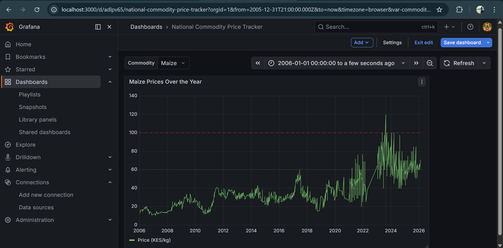

.-----

# Kenya Food Prices ETL Pipeline

### Modern Data Stack: Airflow | Python | Postgres | Snowflake

This project implements a production-grade ETL (Extract, Load, Transform) pipeline that automates the collection, cleaning, and mirroring of Kenyan food price data from the **World Food Programme (WFP)** into a Star Schema architecture.

## 🚀 Project Overview

The pipeline fetches historical food price data, processes it into a relational format, and performs a dual-load:

1.  **Operational Store:** Local PostgreSQL for quick access and staging.
2.  **Cloud Warehouse:** Snowflake for scalable analytics and BI.

-----

## 🏗️ Architecture

The system follows a **Medallion-lite** approach with a focus on a **Star Schema** design:

  * **Orchestration:** Apache Airflow (running in WSL2/Ubuntu).
  * **Transformation:** Python (Pandas) for data type flattening and unit normalization (Price per KG).
  * **Loading:** \* **Incremental:** Processes only new records based on the latest `date_key`.
      * **Full Refresh:** A toggleable safety switch for total data recovery.

-----

## 📊 Data Insights

### Food Price Trends (2006 - 2026)

Below is the time-series analysis generated from the Snowflake `FACT_PRICES` table, showing price fluctuations across various commodities in Kenya.

**

-----

## 🛠️ Tech Stack & Requirements

  * **Python 3.10+** (Snowflake-Connector, Pandas, PyArrow)
  * **Apache Airflow 2.x**
  * **PostgreSQL 15+**
  * **Snowflake Cloud Data Warehouse**

### Key Features

  * **Resiliency:** Implemented `try-except` blocks with Airflow retries.
  * **Performance:** Utilized `write_pandas` with Parquet-based ingestion for Snowflake.
  * **Cleanliness:** Automated schema truncation and `CASCADE` drops during full refreshes.

-----

## 🏁 How to Run

1.  **Configure Environment:** Set up `config.py` with Postgres and Snowflake credentials.
2.  **Install Dependencies:**
    ```bash
    pip install snowflake-connector-python[pandas] apache-airflow pandas pyarrow
    ```
3.  **Trigger Pipeline:**
      * Access Airflow UI at `localhost:8080`.
      * Unpause `kenya_food_prices_pipeline`.
      * Trigger Manual Run (Set `full_refresh: True` for the initial load).

-----

## 🧠 Technical Challenges Overcome

  * **WSL2 Networking:** Configured Airflow to communicate with Windows-hosted Postgres using host-specific IP mapping.
  * **Dependency Management:** Resolved `py_extension_type` conflicts between Snowflake and PyArrow by aligning library versions and managing environment-level timezone flags.
  * 
📜 License
This project is licensed under the MIT License.
-----
